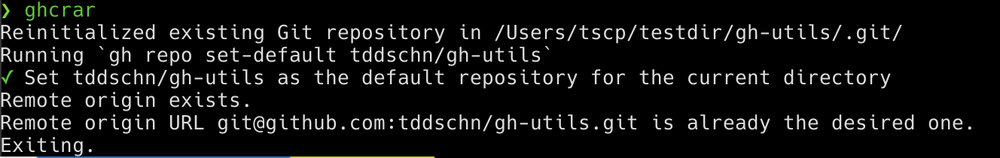
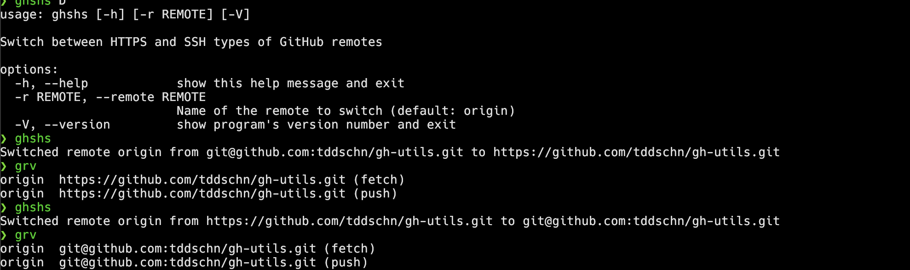

# GH Utilities

A collection of useful utilities that work with GitHub CLI `gh`.

- [GH Utilities](#gh-utilities)
  - [Installation](#installation)
    - [pipx](#pipx)
    - [pip](#pip)
  - [Utilities](#utilities)
    - [ghcrar](#ghcrar)
      - [Features](#features)
      - [Usage](#usage)
      - [Screenshots](#screenshots)
    - [ghshs](#ghshs)
      - [Usage](#usage-1)
      - [Screenshot](#screenshot)
  - [Develop](#develop)

## Installation

### pipx

This is the recommended installation method.

```
$ pipx install gh-utils
```

### [pip](https://pypi.org/project/gh-utils/)

```
$ pip install gh-utils
```

## Utilities

### ghcrar

Short for `gh_create_repo_and_add_to_remote`

#### Features
- Custom GitHub instance hostname support with `--hostname`
- Supports both `ssh` and `https` protocols

#### Usage

```
$ ghcrar --help

usage: ghcrar [-h] [-a SUFFIX] [-n GITHUB REPO NAME] [--public] [--overwrite-remote-origin] [-H {ssh,https}] [-p PROTOCOL] [-S] [-V]

Create a GitHub repo with gh and add it as a remote

options:
  -h, --help            show this help message and exit
  -a SUFFIX, --append SUFFIX
                        String to append to the repo name (default: None)
  -n GITHUB REPO NAME, --name GITHUB REPO NAME
                        The string to use as GitHub repo name, or <user|org>/<repo-name> with a slash (default: None)
  --public              Create a public repository (default: False)
  --overwrite-remote-origin, --force
                        Overwrites remote origin if exists (default: False)
  -H {ssh,https}, --hostname {ssh,https}
                        GitHub hostname, default to use the first entry in hosts.yml (default: github.com)
  -p PROTOCOL, --protocol PROTOCOL
                        git protocol (default: ssh)
  -S, --no-set-default  Do not run `gh repo set-default` (default: False)
  -V, --version         show program's version number and exit
```

#### Screenshots





### ghshs

<!-- cSpell:disable -->
**gh** **s**witch between **h**ttps and **s**sh
<!-- cSpell:enable -->

#### Usage

```
$ ghshs --help

usage: ghshs [-h] [-r REMOTE] [-V]

Switch between HTTPS and SSH types of GitHub remotes

options:
  -h, --help            show this help message and exit
  -r REMOTE, --remote REMOTE
                        Name of the remote to switch (default: origin)
  -V, --version         show program's version number and exit

```

#### Screenshot



## Develop

```
$ git clone https://github.com/tddschn/gh-utils.git
$ cd gh-utils
$ poetry install
```
