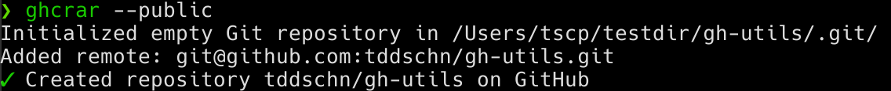

# GH Utilities

A collection of useful utilities that work with GitHub CLI `gh`.

- [GH Utilities](#gh-utilities)
  - [Installation](#installation)
    - [pipx](#pipx)
    - [pip](#pip)
  - [Utilities](#utilities)
    - [ghcrar](#ghcrar)
      - [Source: gh_create_repo_and_add_to_remote.py](#source-gh_create_repo_and_add_to_remotepy)
      - [Usage](#usage)
      - [Screenshots](#screenshots)

## Installation

### pipx

This is the recommended installation method.

```
$ pipx install gh-utils
```

### [pip](https://pypi.org/project/gh-utils/)

```
$ pip install gh-utils
```

## Utilities

### ghcrar


#### Source: [gh_create_repo_and_add_to_remote.py](gh_utils/gh_create_repo_and_add_to_remote.py)


#### Usage

```
$ ghcrar --help

usage: ghcrar [-h] [-a SUFFIX] [-n GITHUB REPO NAME] [--public] [--overwrite_remote_origin] [-V]

Create a GitHub repo with gh and add it as a remote

options:
  -h, --help            show this help message and exit
  -a SUFFIX, --append SUFFIX
                        String to append to the repo name (default: None)
  -n GITHUB REPO NAME, --name GITHUB REPO NAME
                        The string to use as GitHub repo name (default: None)
  --public              Create a public repository (default: False)
  --overwrite_remote_origin, --force
                        Overwrites remote origin if exists (default: False)
  -V, --version         show program's version number and exit
```

#### Screenshots



